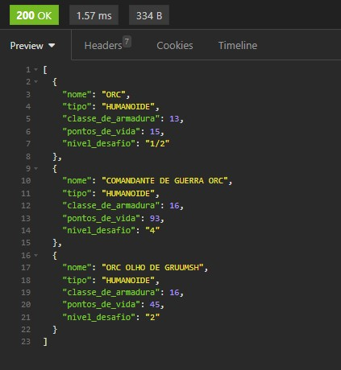

# DnD-5ed-Monsters

## Sobre
  Aplicação Backend para listar todos os monstros do jogo Dungeons and Dragons, de acordo com o livro oficial Manual dos Monstros.

## Características
  1. Adicionar novos mosntros a lista passando as informaçoes obrigatoriamente:
      - Nome (string)
      - Tipo (string)
      - Classe de Armadura (number)
      - Pontos de Vida (number)
      - Nivel de Desafio (string)
  2. Listar os monstros, filtrando pelo nome, tipo ou nivel de desafio.
  3. Alterar um monstro ja contido na lista.
  4. Remover um monstro da lista

## Requerimentos
  - Tenha o npm instalado em sua máquina.
  - Tenha o node instalado em sua máquina.
  - Utilize alguma ferramenta para realizar as ações do tipo POST, PUT ou DELETE, como o Insomnia ou o PostMan.

## Instalação
  1. Clone o repositório.
  2. Abra o terminal na pasta do projeto.
  3. Execute o comando: `npm install`
  4. Inicie a aplicação usando o comando: `npm run dev`

## Rotas
 - GET - **http://localhost:3000/monsters** Lista todos os montros da lista.
 - GET - **http://localhost:3000/monsters/name?search** Lista todos os montros da lista de acordo com o nome passado no *search*.
 - GET - **http://localhost:3000/monsters/type?search** Lista todos os montros da lista de acordo com o tipo passado no *search*.
 - GET - **http://localhost:3000/monsters/challengeLevel?search** Lista todos os montros da lista de acordo com o nivel de desafio passado no *search*.
 - POST - **http://localhost:3000/monsters** Adiciona um novo monstro, passando as informações no corpo da requisição.
 - PUT - **http://localhost:3000/monsters/name** Altera as informação do monstro selecionado pelo parametro *name*, as novas informações são passadas no corpo da requisição.
 - DELETE - **http://localhost:3000/monsters/name** Remove o monstro selecionado pelo parametro *name*.

##Screenshots

 1. Exemplo de uma requisição para adicionar um monstro:
    
    

2. Exemplo da resposta de uma busca filtrando pelo nome (orc):

   

3. Exemplo da resposta de uma busca filtrando pelo tipo (morto-vivo):

   
   
